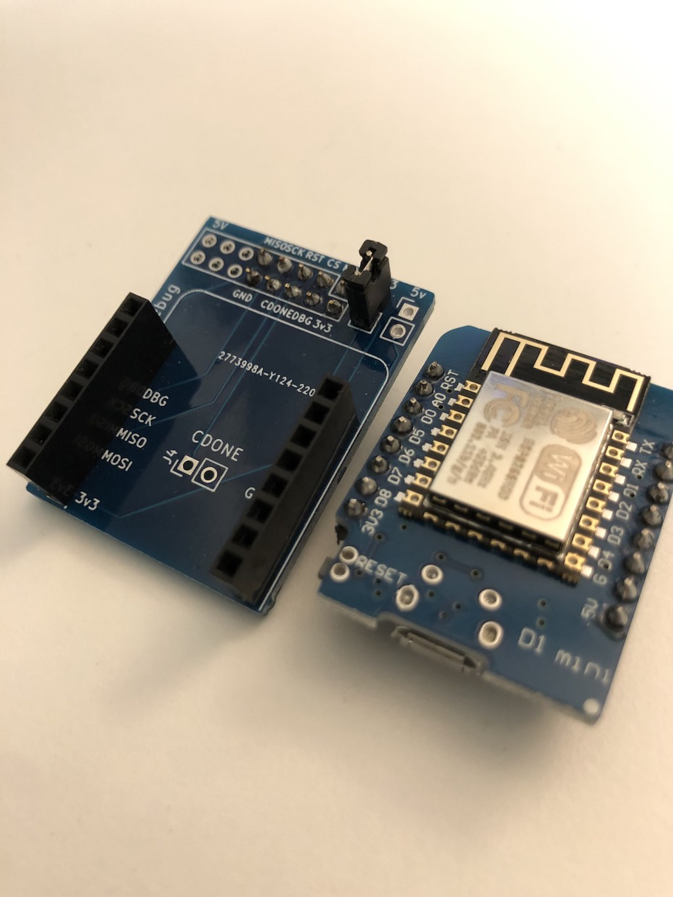
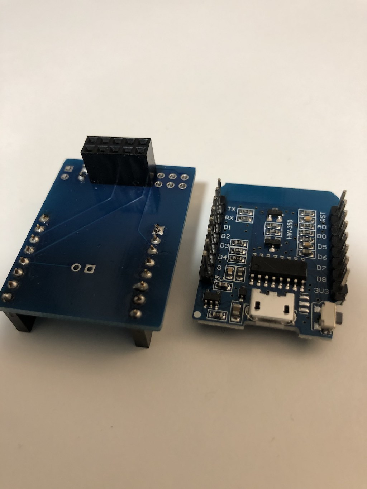
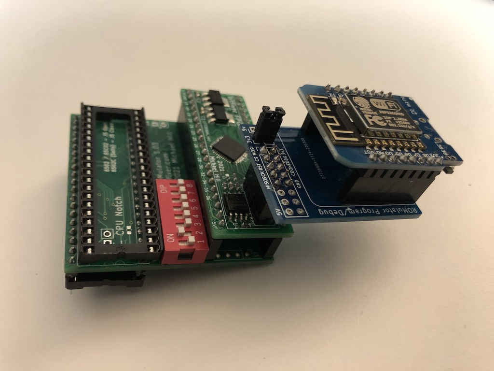

# Programming/Debug using Standalone Programmer

## Assembly

The following images show the assembly of the standalone programming/debugging kit, as well as how to connect to the ROMulator.





The standalone programmer for the ROMulator consists of a D1 Mini board and an interface board to connect the D1 Mini to the ROMulator's 10-pin header.
First step is to install the build tools on your Win/Mac/Linux machine. You will build new firmware images here. For Mac and Linux the install is fairly straightforward and just requires running a script. On Windows, however, some build dependencies are not natively supported, and requires installing a Linux distro using WSL (windows subsystem for linux). 
Instructions for each OS:

## Windows

Use the Microsoft Store to install a linux distribution with apt as a package manager. Either Ubuntu or Debian recommended.\
After installation, your windows filesystem is accessible in /mnt, i.e. C: is at /mnt/c/, etc.\
Create a directory for your installation somewhere easily accessible to both linux and windows, i.e. /mnt/c/home/Users/username/romulator. Change to this directory and follow the instructions for Linux at this point.

## Linux

Create a directory for your install.\
Then fetch and run the linux setup script from linux command line in this directory with (one line)\
```wget https://raw.githubusercontent.com/bitfixer/bf-romulator/master/setup_linux.sh; ./setup_linux.sh```\
You will need to enter your password as some commands in the setup script require sudo.

## Mac (10.15 or higher)

If not installed already, install homebrew using instructions here.:\
[homebrew installation](https://brew.sh)\
Create a directory for your romulator installation.\
Then open Terminal, change to the install directory, and run this (one line):\
```curl https://raw.githubusercontent.com/bitfixer/bf-romulator/master/setup_mac.sh > setup_mac.sh; chmod 755 setup_mac.sh; ./setup_mac.sh```\
You will need to enter your password at some point during the installation.

# Programming

To build firmware, in a terminal run\
```make romulator```\
from the bf-romulator directory. The firmware file will be bin/romulator.bin.\

# Setting up the standalone programmer

Using the standalone programmer, you can program/debug through a web interface once the programmer has connected to your WiFi network, or you can program using a serial terminal program while connected to USB.\

If you are using your own D1 Mini board, you will first need to program it with debugging/programming firmware which is described here. If you ordered the standalone programmer kit from bitfixer.com, it will come pre-programmed and you can skip ahead, although you will need to do this to install any firmware updates.\

## Programming D1 Mini

To program the D1 Mini with the romulator debug/program firmware, you need to build and install with platformio. I will describe how to do this using platformio as a plugin to Visual Studio Code, it is also possible to do this with platformio as a pure command line installation, but I find the VSCode method easier to use.

Install [Visual Studio Code](https://code.visualstudio.com/) on your computer (Mac/Linux/Windows), free download for all platforms.\
After install, launch and then select 'Extensions' (View->Extensions). Search for 'PlatformIO IDE' and install the plugin.\
After this, open the 'romulator-programmer-debugger' directory in File->Open Directory (or Open Folder).\
PlatformIO will do some installation and eventually ask you to restart VSCode.\
Do this, then connect to the D1 Mini board with USB and eventually you should see a right arrow on the bottom bar of the IDE (the tooltip is PlatformIO: Upload).\
Select this. You may see a message to the effect that 'romulator-programmer-debugger.upload' does not exist - in this case just wait and try again, PlatformIO is doing something in the background. Eventually this will work and build and install on your D1 Mini. It is possible you may have to specify a value for 'upload-port', which will be the id of a serial port on your system, but generally it will auto-detect this.\

After programming the board, you will also need to upload a filesystem image onto it. This contains some files needed to run the web interface on the D1 Mini.\
To do this, select the PlatformIO menu (on the toolbar located on the left of the VSCode window, a little alien face) and then Platform->Upload Filesystem Image.\
This will upload the needed files to the D1 Mini. Now you are done!

## Web Interface

Power up your D1 Mini. On first power-up the LED will start blinking. After a few seconds, on a device of your choice, connect to the wifi network 'romulator'. This will have a password of 'bitfixer'.\
Then in a browser go to 192.168.4.1. This will bring up a page which allows you to enter the name and password to connect to your wifi router. After doing this, you are prompted to reset the D1 Mini.\

At this point, your standalone programmer is ready to go. Connect the D1 Mini to the interface board, and then connect to the ROMulator as shown here.

Now you can power up, and wait for the blinking LED to stop blinking and be solidly on. This indicates that the board has successfully connected to your router and is now on your wifi network.\

Here is one tricky part. The D1 Mini is supposed to be able to self-report a hostname, much like the raspberry pi does on your local network (raspberrypi.local). This would be convenient, since you could refer to this address rather than needing to know the local IP that your router happens to assign to the device. However, I was not able to get this to work, despite trying sample code exactly which claimed to do this. Possibly a router misconfiguration on my part. Feel free to let me know if you have any insights on this.\
For this reason, I added a simple redirect service hosted on my site, bitfixer.com.\
Once the D1 Mini successfully connects to your network, it makes a single request to http://bitfixer.com/rmltr/r.php. Included in this request is the local IP address the device was given by your router.\
After your D1 Mini connects, you can then reach its web interface by going here:\
[http://bitfixer.com/myromulator](http://bitfixer.com/myromulator)\
This reads the IP of the incoming request, which will match the IP of the D1 Mini since they are on the same network, and will redirect you back to the D1 Mini's local IP. This allows you to reach the web interface without knowing the specific local IP.\
You can also just check the local IP of the device on your router as well and connect directly to it, either method works.\

Once connected to the web interface, you can program the ROMulator with the firmware you built, which will be in bin/romulator.bin in the bf-romulator directory. Just select 'Program' on the webpage and then select this file, and wait until the upload and programming completes. That's it!\

## Serial Interface

It is also possible to program the romulator using a serial terminal, without using the web interface at all.

To do this, when connected to the D1 Mini with USB, launch a terminal program that supports serial ports and Xmodem file transfer. Good examples are minicom on mac/linux, or TeraTerm on Windows. Set the baud rate to 115200.

You will need to find the id of the serial port on the D1 Mini. This id varies but has some commonalities. On Mac/Linux, try ```ls /dev/tty.usb*``` or ```ls /dev/tty*```. This will show some possible device names, you can try disconnecting the device, listing, then connecting and listing again to find which id shows up. If there is a better way to do this, please let me know.\
On Windows, it often shows up as COM6 or COM7, generally the first com port over COM2 is the one. If the terminal shows a name associated with each com port, it will be the one with a name like 'usb-to-serial' something.

Once connected with the right baud rate, hit the reset button on the D1 Mini. A menu should show up in the terminal. To program, type 'p' for the programming menu and then 'p' again to program firmware. You will be prompted to send the file using XMODEM, then go ahead and using the menu on your terminal program, select bin/romulator.bin and start the transfer. This will upload the file to the device and program the romulator.
